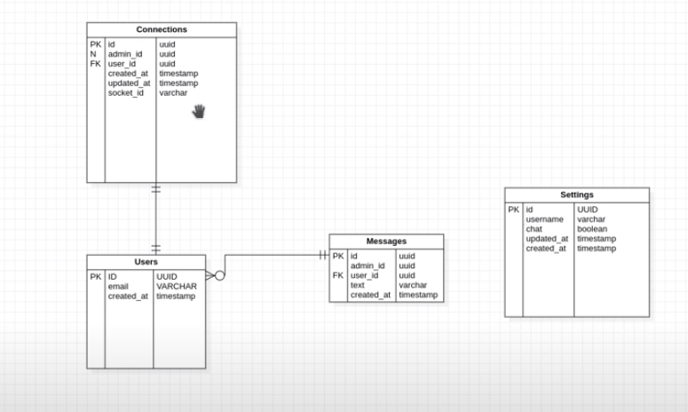

<h1 align="center">Chatty-NLW</h1>

  <a href="#-tecnologias">Tecnologias</a>&nbsp;&nbsp;&nbsp;|&nbsp;&nbsp;&nbsp;
  <a href="#-projeto">Projeto</a>&nbsp;&nbsp;&nbsp;|&nbsp;&nbsp;&nbsp;
  <a href="#-diagrama">Diagrama</a>&nbsp;&nbsp;&nbsp;|&nbsp;&nbsp;&nbsp;
  <a href="#-como-executar">Como executar</a>&nbsp;&nbsp;&nbsp;|&nbsp;&nbsp;&nbsp;
  <a href="#-licença">Licença</a>

  

 

 

  

## ✨ Tecnologias

Esse projeto foi desenvolvido com as seguintes tecnologias e ferramentas:

- [TypeScript](https://www.typescriptlang.org/)
- [Node.js](https://nodejs.org/en/)
- [TypeORM](https://typeorm.io/#/)
- [Express](https://expressjs.com/pt-br/)
- [Yarn](https://yarnpkg.com/)
- [Sqlite](https://www.sqlite.org/)
- [SQL Editor Beekeeper Studio](https://www.beekeeperstudio.io/)
- [Insomnia | The API Design Platform and REST Client](https://insomnia.rest/)

## 💻 Projeto

O Chatty-NLW é uma aplicação que consiste em um chat de suporte para usuários de um sistema. Nele é realizado o cadastro de usuários e de configurações do sistema. Com isso é feita uma comunicação via websockets entre o cliente e o atendente para manter o chat.

Esse projeto foi desenvolvido durante a trilha de NodeJS, na quinta edição da NLW. Foi aprendido conceitos sobre como iniciar um projeto utilizando Typescript e Express para gerenciamento das rotas, TypeORM para manipulação em banco de dados e comunicação com websockets.

## 🔶 Diagrama

## 🚀 Como executar

- Clone o repositório
- Configure o banco de dados
- Instale as dependências com `yarn`
- Inicie o servidor com `yarn dev`

A aplicação pode ser acessada em [`localhost:3333`](http://localhost:3333).

## 📄 Licença

Esse projeto está sob a licença MIT. Veja o arquivo [LICENSE](LICENSE.md) para mais detalhes.
